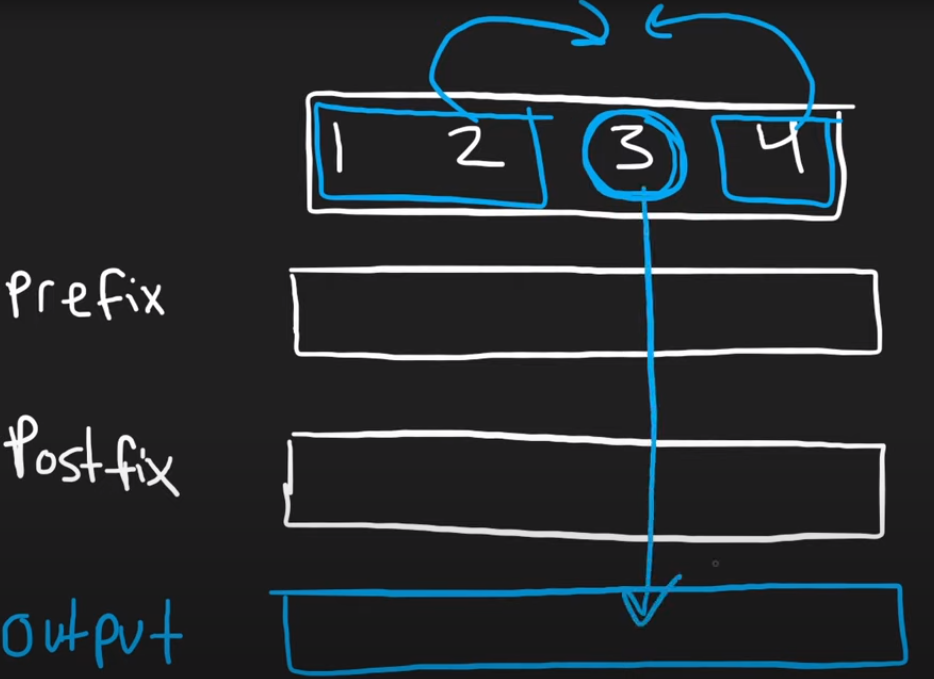
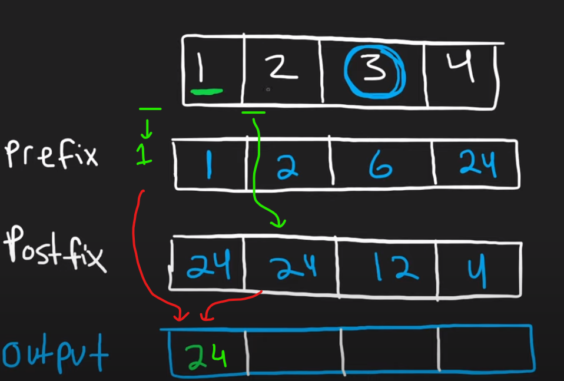
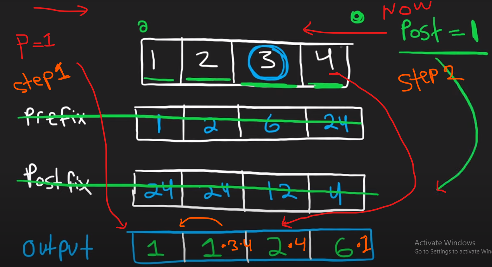

## 4. Product of Array Except Self


[Problem Link](https://leetcode.com/problems/product-of-array-except-self/)


### Problem statement: 
---
Given an integer array nums, return an array answer such that answer[i] is equal to the product of all the elements of nums except nums[i].

The product of any prefix or suffix of nums is guaranteed to fit in a 32-bit integer.

You must write an algorithm that runs in O(n) time and without using the **division operation**.

### Example 1
    
    Input: nums = [1,2,3,4]
    Output: [24,12,8,6]

### Example 2

    Input: nums = [-1,1,0,-3,3]
    Output: [0,0,9,0,0]

## Constraints:
    
    2 <= nums.length <= 105
    -30 <= nums[i] <= 30

    The product of any prefix or suffix of nums is guaranteed to fit in a 32-bit integer.
 
    Follow up: Can you solve the problem in O(1) extra space complexity? (The output array does not count as extra space for space complexity analysis.)

### How to think and hint:
---

#### Method 1






<br/>

    Time Complexity : O(n)  
    Space Complexity: O(n)  

#### Method 2

How we can reduse space in this mathod 1 solution <br/>
- First output array store Prefix vlaue by Camulative product *
- Second step Postfix calculate and put into output with prefix result product *



<br/>

    Time Complexity : O(n)  
    Space Complexity: O(1)    

### Write down code
---

### Method 1

```C++
  class Solution {
public:
    vector<int> productExceptSelf(vector<int>& nums) {
        
        vector<int> ans;

        int preVal = 1;
        int postVal = 1;

        vector<int> preFx(nums.size());
        vector<int> postFx(nums.size());

        int n = nums.size()-1;
        
        for(int i = 0; i <= n; i++)
        {
            preFx[i] = preVal * nums[i];
            preVal = preFx[i];

            postFx[n-i] = postVal * nums[n-i];
            postVal = postFx[n-i];
        }

        // output calculation 
        preVal = 1;
        for(int i = 0; i < n; i++)
        {     // n - 1 stop coz i+1 value need

            ans.push_back(preVal * postFx[i+1]);
            preVal = preFx[i]; 

            if(i + 1 == n)
            {
                ans.push_back(preVal); // last value insert manualy 
            }
            // \ both preFx and postFx arr move one step forward up to length 

        }

        return ans;
    }
};
```

```C++
class Solution {
public:
    vector<int> productExceptSelf(vector<int>& nums) {
        
        vector<int> ans;

        int preFxVal = 1;
        // Setp 1 left to right 
        for(int i = 0; i < nums.size(); i++)
        {
            ans.push_back(preFxVal);
         
            preFxVal = preFxVal * nums[i]; 
        }

        // Step 2  Right to left 
        int postFxVal = 1;
        for(int i = nums.size()-1; i >= 0; i--)
        {
           
            ans[i] = ans[i] * postFxVal;


            postFxVal = postFxVal * nums[i]; // update postVal
        }


       
        return ans;
    }
};
```